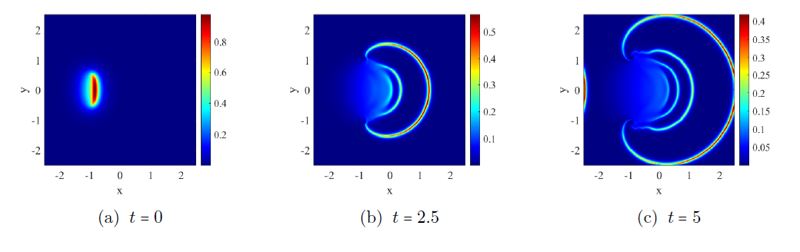
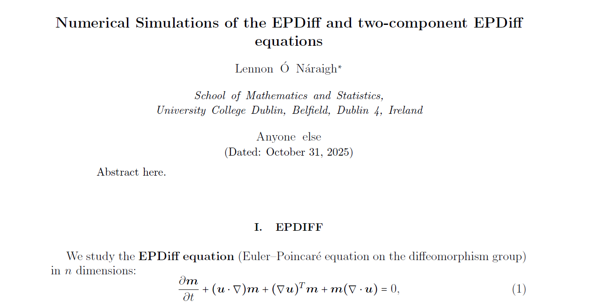

# EPDIFF

Suite of codes codes for a solving the EPDiff equation in two spatial dimensions.

# Project overview:

* Theory and code analysis is documented in notes1.pdf (clickable version below)
* Simple EPDIFF code (in Matlab) is provided in Simple_EPDIFF/
* Two-component EPDIFF code (in Matlab) provided in TwoComponent_EPDIFF/

